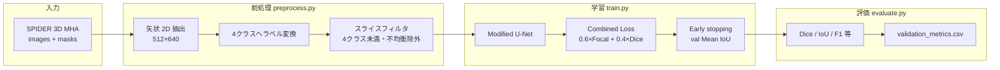
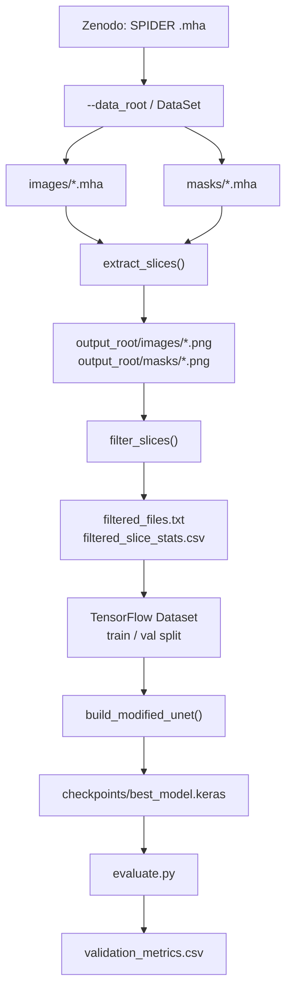
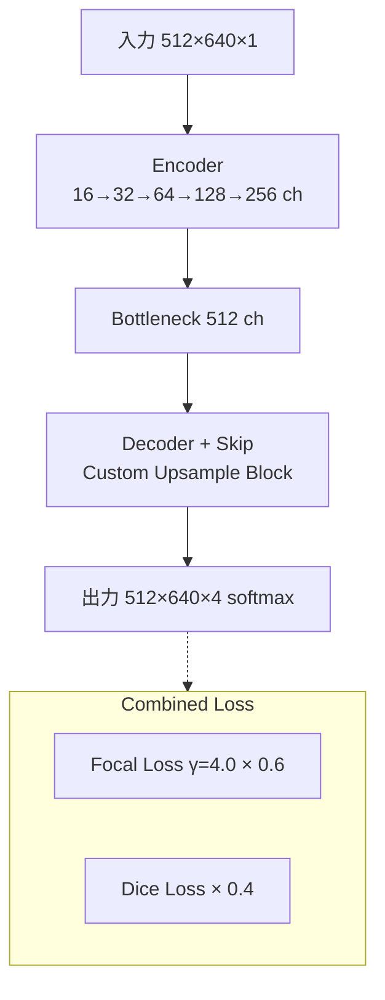

# LumbarSeg

**Languages / 语言 / 言語:** [English](README.md) · [中文](README.zh-CN.md) · **日本語**

腰椎 MRI の **4クラスセグメンテーション** を、Ahmed et al. (2025) のベースライン（Modified U-Net + Combined Loss）で再現する卒業研究用リポジトリです。

| リンク | |
| --- | --- |
| 論文（再現対象） | [Ahmed et al., 2025](https://www.sciencedirect.com/science/article/pii/S2666827025000180) |
| データセット | [SPIDER (Zenodo)](https://doi.org/10.5281/zenodo.10159290) |
| 実験ページ（任意） | [GitHub Pages](https://sol-momma.github.io/LumbarSeg/) |

---

## 研究の目的

1. **Stage 1**: 論文と同じ前処理・モデル・損失で Dice ≈ 0.97（T2 SPACE）を再現する  
2. **Stage 2**: 再現後にアーキテクチャ・拡張・損失の改良で精度を上回る

### セグメンテーションクラス（4クラス）

| ID | 構造 | SPIDER 元ラベル |
| ---: | --- | --- |
| 0 | Background | `0` |
| 1 | Vertebrae（椎体） | `1–99` |
| 2 | Spinal Canal（脊柱管） | `100` |
| 3 | IVDs（椎間板） | `200+` |

### 論文の目標指標（T2 SPACE・参考）

| 構造 | Dice | IoU |
| --- | ---: | ---: |
| IVDs | 0.9688 | 0.9476 |
| Vertebrae | 0.9712 | 0.9461 |
| Spinal Canal | 0.9671 | 0.9501 |

---

## 全体の流れ（研究パイプライン）



---

## データの流れ（詳細）



### フィルタ条件（論文準拠）

- マスクに **4クラス未満** のスライスを除外  
- 前景クラスの最大占有率が **55%超** のスライスを除外（`--imbalance_threshold 0.55`）  
- シーケンスごとに保持上限 **1000枚**（`--max_slices_per_sequence`、0 で無制限）

---

## モデルと損失



- 活性化: Leaky ReLU（α=0.1）  
- 初期化: Glorot uniform  
- Dropout: 論文スケジュール（0.1 / 0.2 / 0.3）  
- 最適化: Adam、`lr=1e-4`、batch_size=8、最大100 epoch

---

## リポジトリ構成

```text
LumbarSeg/
├── preprocess.py          # 前処理のみ
├── train.py               # 前処理 + 学習
├── evaluate.py            # 検証セット評価
├── arguments/             # CLI 引数（データ・モデル・最適化）
├── spine_baseline/        # 前処理・データセット・モデル・損失・指標
├── data/                  # SPIDER メタデータ（画像本体は含まない）
├── requirements-baseline.txt
├── flake.nix              # 任意: 開発環境のバージョン固定
└── src/                   # 任意: Astro 実験ページ
```

| モジュール | 役割 |
| --- | --- |
| `spine_baseline/preprocessing.py` | MHA 読込、矢状抽出、リサイズ、ラベル変換、フィルタ |
| `spine_baseline/model.py` | Modified U-Net |
| `spine_baseline/losses.py` | Combined Loss |
| `spine_baseline/metrics.py` | Dice, Mean IoU 等 |
| `spine_baseline/dataset.py` | `tf.data` パイプライン |

---

## クイックスタート

### 1. クローンと依存関係

```bash
git clone https://github.com/Sol-momma/LumbarSeg.git
cd LumbarSeg
python -m venv .venv
source .venv/bin/activate   # Windows: .venv\Scripts\activate
pip install -r requirements-baseline.txt
```

Nix を使う場合: `nix develop` のあと、上と同様に `.venv` を作成してください。

### 2. データ配置

[Zenodo](https://doi.org/10.5281/zenodo.10159290) から SPIDER を取得し、次の形にします（詳細は [data/README.md](data/README.md)）。

```text
/path/to/SPIDER/DataSet/
├── images/
├── masks/
└── SPIDER Lumbar Spine Segmentation Overview.csv
```

### 3. 前処理

```bash
python preprocess.py \
  --data_root /path/to/SPIDER/DataSet \
  --output_root outputs/t2_space_baseline \
  --sequences T2_SPACE
```

### 4. スモークテスト（必須）

本学習の前に **1 epoch** でパイプラインを確認します。

```bash
python train.py \
  --data_root /path/to/SPIDER/DataSet \
  --output_root outputs/t2_space_baseline \
  --sequences T2_SPACE \
  --epochs 1 \
  --batch_size 2
```

### 5. 本学習

```bash
python train.py \
  --data_root /path/to/SPIDER/DataSet \
  --output_root outputs/t2_space_baseline \
  --sequences T2_SPACE \
  --batch_size 8 \
  --epochs 100
```

出力例:

```text
outputs/t2_space_baseline/
├── images/ masks/
├── filtered_files.txt
├── filtered_slice_stats.csv
└── checkpoints/
    ├── best_model.keras
    ├── final_model.keras
    └── training_log.csv
```

### 6. 評価

```bash
python evaluate.py \
  --data_root /path/to/SPIDER/DataSet \
  --output_root outputs/t2_space_baseline \
  --model_path outputs/t2_space_baseline/checkpoints/best_model.keras
```

---

## Google Colab（GPU 推奨）

```python
from google.colab import drive
drive.mount("/content/drive")
```

```bash
%cd /content
!test -d LumbarSeg && (cd LumbarSeg && git pull) || git clone https://github.com/Sol-momma/LumbarSeg.git
%cd /content/LumbarSeg
!pip install -q -r requirements-baseline.txt
```

```python
import tensorflow as tf
print(tf.__version__)
print(tf.config.list_physical_devices("GPU"))  # GPU が [] のときはランタイムを GPU に変更
```

```bash
!python preprocess.py \
  --data_root /content/drive/MyDrive/SPIDER/DataSet \
  --output_root /content/drive/MyDrive/SPIDER/outputs/t2_space_baseline \
  --sequences T2_SPACE

!python train.py \
  --data_root /content/drive/MyDrive/SPIDER/DataSet \
  --output_root /content/drive/MyDrive/SPIDER/outputs/t2_space_baseline \
  --sequences T2_SPACE \
  --epochs 1 --batch_size 2

!python evaluate.py \
  --data_root /content/drive/MyDrive/SPIDER/DataSet \
  --output_root /content/drive/MyDrive/SPIDER/outputs/t2_space_baseline \
  --model_path /content/drive/MyDrive/SPIDER/outputs/t2_space_baseline/checkpoints/best_model.keras
```

> **注意**: ランタイムが CPU のままだと学習が極端に遅くなります。Colab メニュー「ランタイムのタイプを変更」→ **GPU** を選んでから実行してください。

---

## 進捗（2026年6月時点）

- [x] ベースライン実装（前処理・学習・評価 CLI）
- [x] Colab 上で前処理 → 1 epoch 学習 → 評価まで動作確認
- [ ] Colab **GPU** での本学習（100 epoch）
- [ ] 論文 Dice との定量比較
- [ ] 予測マスクの MRI オーバーレイ可視化
- [ ] T1 / T2 への拡張、改良モデル（Stage 2）

---

## 主要 CLI 引数

| 引数 | 既定値 | 説明 |
| --- | ---: | --- |
| `--target_height` / `--target_width` | 512 / 640 | 入力スライスサイズ |
| `--sequences` | なし（全シーケンス） | `T1`, `T2`, `T2_SPACE`（カンマ区切り可） |
| `--imbalance_threshold` | 0.55 | 前景クラス最大比率の上限 |
| `--max_slices_per_sequence` | 1000 | シーケンスごとの保持上限（0 で無制限） |
| `--batch_size` | 8 | バッチサイズ |
| `--epochs` | 100 | 最大エポック数 |
| `--focal_weight` / `--focal_gamma` | 0.6 / 4.0 | Combined Loss |
| `--patience` | 15 | Early stopping |

---

## 参考文献

1. Ahmed, I. et al. *Pioneering Precision in Lumbar Spine MRI Segmentation with Advanced Deep Learning and Data Enhancement.* Machine Learning with Applications, Vol. 20, 2025.  
2. van der Graaf, J.W. et al. *Lumbar spine segmentation in MR images: a dataset and a public benchmark.* Scientific Data, 11:264, 2024.
