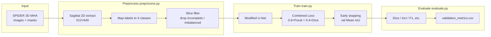
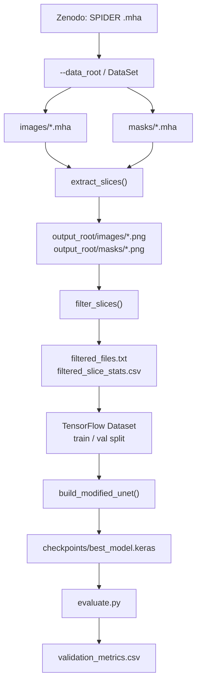
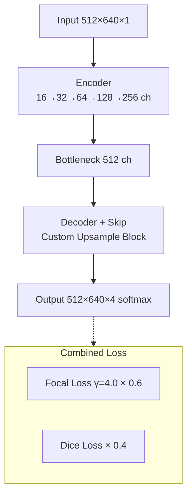

# LumbarSeg

**Languages / 语言 / 言語:** **English** · [中文](README.zh-CN.md) · [日本語](README.ja.md)

Graduation research repository for reproducing **four-class lumbar MRI segmentation** using the Ahmed et al. (2025) baseline (Modified U-Net + Combined Loss).

| Link | |
| --- | --- |
| Target paper | [Ahmed et al., 2025](https://www.sciencedirect.com/science/article/pii/S2666827025000180) |
| Dataset | [SPIDER (Zenodo)](https://doi.org/10.5281/zenodo.10159290) |
| Experiment page (optional) | [GitHub Pages](https://sol-momma.github.io/LumbarSeg/) |

---

## Research Goals

1. **Stage 1**: Reproduce Dice ≈ 0.97 on T2 SPACE with the same preprocessing, model, and loss as the paper  
2. **Stage 2**: Improve accuracy via architecture, augmentation, and loss refinements after reproduction

### Segmentation Classes (4 classes)

| ID | Structure | SPIDER source labels |
| ---: | --- | --- |
| 0 | Background | `0` |
| 1 | Vertebrae | `1–99` |
| 2 | Spinal Canal | `100` |
| 3 | IVDs (intervertebral discs) | `200+` |

### Target Metrics from the Paper (T2 SPACE, reference)

| Structure | Dice | IoU |
| --- | ---: | ---: |
| IVDs | 0.9688 | 0.9476 |
| Vertebrae | 0.9712 | 0.9461 |
| Spinal Canal | 0.9671 | 0.9501 |

---

## Overall Pipeline



---

## Data Flow (Detail)



### Filtering Rules (paper-aligned)

- Drop slices with **fewer than 4 classes** in the mask  
- Drop slices where the dominant foreground class exceeds **55%** (`--imbalance_threshold 0.55`)  
- Cap kept slices at **1000 per sequence** (`--max_slices_per_sequence`; use `0` for no cap)

---

## Model and Loss



- Activation: Leaky ReLU (α=0.1)  
- Initialization: Glorot uniform  
- Dropout: paper schedule (0.1 / 0.2 / 0.3)  
- Optimizer: Adam, `lr=1e-4`, batch_size=8, up to 100 epochs

---

## Repository Layout

```text
LumbarSeg/
├── preprocess.py          # preprocessing only
├── train.py               # preprocess + train
├── evaluate.py            # validation metrics
├── arguments/             # CLI groups (data, model, optimization)
├── spine_baseline/        # preprocessing, dataset, model, loss, metrics
├── data/                  # SPIDER metadata (no MRI volumes in repo)
├── requirements-baseline.txt
├── flake.nix              # optional: pin dev toolchain
└── src/                   # optional: Astro experiment site
```

| Module | Role |
| --- | --- |
| `spine_baseline/preprocessing.py` | MHA I/O, sagittal extraction, resize, label map, filter |
| `spine_baseline/model.py` | Modified U-Net |
| `spine_baseline/losses.py` | Combined Loss |
| `spine_baseline/metrics.py` | Dice, Mean IoU, etc. |
| `spine_baseline/dataset.py` | `tf.data` pipeline |

---

## Quick Start

### 1. Clone and install

```bash
git clone https://github.com/Sol-momma/LumbarSeg.git
cd LumbarSeg
python -m venv .venv
source .venv/bin/activate   # Windows: .venv\Scripts\activate
pip install -r requirements-baseline.txt
```

With Nix: run `nix develop`, then create `.venv` as above.

### 2. Dataset layout

Download SPIDER from [Zenodo](https://doi.org/10.5281/zenodo.10159290) and arrange (see [data/README.md](data/README.md)):

```text
/path/to/SPIDER/DataSet/
├── images/
├── masks/
└── SPIDER Lumbar Spine Segmentation Overview.csv
```

### 3. Preprocess

```bash
python preprocess.py \
  --data_root /path/to/SPIDER/DataSet \
  --output_root outputs/t2_space_baseline \
  --sequences T2_SPACE
```

### 4. Smoke test (required)

Run **1 epoch** before full training to verify the pipeline:

```bash
python train.py \
  --data_root /path/to/SPIDER/DataSet \
  --output_root outputs/t2_space_baseline \
  --sequences T2_SPACE \
  --epochs 1 \
  --batch_size 2
```

### 5. Full training

```bash
python train.py \
  --data_root /path/to/SPIDER/DataSet \
  --output_root outputs/t2_space_baseline \
  --sequences T2_SPACE \
  --batch_size 8 \
  --epochs 100
```

Example outputs:

```text
outputs/t2_space_baseline/
├── images/ masks/
├── filtered_files.txt
├── filtered_slice_stats.csv
└── checkpoints/
    ├── best_model.keras
    ├── final_model.keras
    └── training_log.csv
```

### 6. Evaluate

```bash
python evaluate.py \
  --data_root /path/to/SPIDER/DataSet \
  --output_root outputs/t2_space_baseline \
  --model_path outputs/t2_space_baseline/checkpoints/best_model.keras
```

---

## Google Colab (GPU recommended)

```python
from google.colab import drive
drive.mount("/content/drive")
```

```bash
%cd /content
!test -d LumbarSeg && (cd LumbarSeg && git pull) || git clone https://github.com/Sol-momma/LumbarSeg.git
%cd /content/LumbarSeg
!pip install -q -r requirements-baseline.txt
```

```python
import tensorflow as tf
print(tf.__version__)
print(tf.config.list_physical_devices("GPU"))  # if [], switch runtime to GPU
```

```bash
!python preprocess.py \
  --data_root /content/drive/MyDrive/SPIDER/DataSet \
  --output_root /content/drive/MyDrive/SPIDER/outputs/t2_space_baseline \
  --sequences T2_SPACE

!python train.py \
  --data_root /content/drive/MyDrive/SPIDER/DataSet \
  --output_root /content/drive/MyDrive/SPIDER/outputs/t2_space_baseline \
  --sequences T2_SPACE \
  --epochs 1 --batch_size 2

!python evaluate.py \
  --data_root /content/drive/MyDrive/SPIDER/DataSet \
  --output_root /content/drive/MyDrive/SPIDER/outputs/t2_space_baseline \
  --model_path /content/drive/MyDrive/SPIDER/outputs/t2_space_baseline/checkpoints/best_model.keras
```

> **Note:** Training on CPU is extremely slow. In Colab, use **Runtime → Change runtime type → GPU** before training.

---

## Progress (as of June 2026)

- [x] Baseline CLI (preprocess, train, evaluate)
- [x] Colab smoke test: preprocess → 1-epoch train → evaluate
- [ ] Full training on Colab **GPU** (100 epochs)
- [ ] Quantitative comparison with paper Dice scores
- [ ] Overlay visualization of predicted masks on MRI
- [ ] T1 / T2 experiments and Stage 2 improvements

---

## Key CLI Arguments

| Argument | Default | Description |
| --- | ---: | --- |
| `--target_height` / `--target_width` | 512 / 640 | Input slice size |
| `--sequences` | all | `T1`, `T2`, `T2_SPACE` (comma-separated) |
| `--imbalance_threshold` | 0.55 | Max dominant foreground fraction |
| `--max_slices_per_sequence` | 1000 | Cap per sequence (`0` = unlimited) |
| `--batch_size` | 8 | Batch size |
| `--epochs` | 100 | Max epochs |
| `--focal_weight` / `--focal_gamma` | 0.6 / 4.0 | Combined Loss |
| `--patience` | 15 | Early stopping patience |

---

## References

1. Ahmed, I. et al. *Pioneering Precision in Lumbar Spine MRI Segmentation with Advanced Deep Learning and Data Enhancement.* Machine Learning with Applications, Vol. 20, 2025.  
2. van der Graaf, J.W. et al. *Lumbar spine segmentation in MR images: a dataset and a public benchmark.* Scientific Data, 11:264, 2024.
