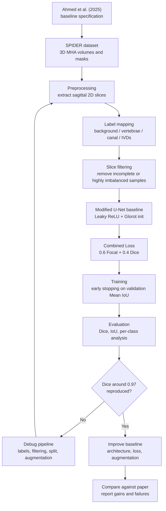

<div align="center">
  <h1>LumbarSeg</h1>
  <h2>Four-Class Lumbar MRI Segmentation with a Paper-Aligned U-Net Baseline</h2>

  [Project Page](https://sol-momma.github.io/LumbarSeg/) |
  [Paper](https://www.sciencedirect.com/science/article/pii/S2666827025000180) |
  [SPIDER Dataset](https://doi.org/10.5281/zenodo.10159290) |
  [Japanese Notes](docs/readme_ja.md)
</div>

---

## What Is LumbarSeg?

LumbarSeg is a graduation research project for reproducing and extending the
lumbar spine MRI segmentation method proposed by Ahmed et al. (2025).

The baseline segments sagittal lumbar MRI slices into four pixel-wise classes:

| Class | Structure | Clinical role |
| --- | --- | --- |
| 0 | Background | Non-anatomical region |
| 1 | Vertebrae | Bone structure assessment |
| 2 | Spinal Canal | Stenosis-related anatomy |
| 3 | Intervertebral Discs | Disc degeneration / herniation analysis |

The first goal is to reproduce the reported Dice score around **0.97**. The
second goal is to improve the baseline through stronger architectures, losses,
augmentation, and error analysis.

## Why This Project Matters

- **Paper-aligned baseline**: Modified U-Net with Leaky ReLU, Glorot
  initialization, and Combined Loss.
- **Real medical dataset**: SPIDER contains 218 patients and 447 MRI series from
  multiple centers.
- **Reproducible training entrypoints**: preprocessing, training, and evaluation
  are available as root-level CLI scripts.
- **Research page included**: the Astro site summarizes the paper, model,
  metrics, and experiment workflow.
- **Cost-conscious workflow**: small local/Colab smoke tests first; GPU training
  only after the pipeline is verified.

## Latest Updates

#### [2026-05] FastGS-style repository cleanup

- Added CLI entrypoints: `preprocess.py`, `train.py`, `evaluate.py`
- Split baseline code into `spine_baseline/`
- Added the interactive Astro experiment viewer
- Renamed the research project identity to **LumbarSeg**
- Moved the original Japanese README to [docs/readme_ja.md](docs/readme_ja.md)

## Method Overview

### Research Workflow



### Data Pipeline

```text
SPIDER 3D MHA volumes
  -> sagittal 2D slice extraction
  -> 512 x 640 resize
  -> SPIDER labels mapped to 4 classes
  -> incomplete / highly imbalanced slices filtered
  -> TensorFlow Dataset
```

### Label Mapping

```text
0       -> 0 Background
1-99    -> 1 Vertebrae
100     -> 2 Spinal Canal
200+    -> 3 Intervertebral Discs
```

### Baseline Model

- Modified U-Net
- Leaky ReLU with alpha = 0.1
- Glorot / Xavier initialization
- 512-channel bottleneck
- 4-channel softmax output

### Loss

```text
Combined Loss = 0.6 * Focal Loss(gamma=4.0) + 0.4 * Dice Loss
```

## Target Results

Reported T2 SPACE validation performance from Ahmed et al. (2025):

| Structure | Dice | IoU |
| --- | ---: | ---: |
| IVDs | 0.9688 | 0.9476 |
| Vertebrae | 0.9712 | 0.9461 |
| Spinal Canal | 0.9671 | 0.9501 |

## Hardware Notes

Local Mac execution is useful for code editing and small smoke tests. Full
training should be run on a GPU environment.

Recommended low-cost workflow:

1. Run `--epochs 1` smoke tests locally or on free Colab.
2. Run short `--epochs 5` experiments on free Colab.
3. Use Colab Pro or a cloud GPU only for full training runs.

## Quick Start

### Clone

```bash
git clone https://github.com/Sol-momma/LumbarSeg.git
cd LumbarSeg
```

### Environment

Recommended for local development:

```bash
nix develop
```

Then create a Python virtual environment inside the Nix shell:

```bash
python -m venv .venv
source .venv/bin/activate
pip install -r requirements-baseline.txt
```

See [docs/nix.md](docs/nix.md) for the full Nix workflow.

For Colab:

```bash
!git clone https://github.com/Sol-momma/LumbarSeg.git
%cd LumbarSeg
!pip install -r requirements-baseline.txt
```

### Dataset Organization

The `--data_root` directory should contain:

```text
DataSet/
├── images/
│   ├── 100_t1.mha
│   ├── 100_t2.mha
│   └── ...
├── masks/
│   ├── 100_t1.mha
│   ├── 100_t2.mha
│   └── ...
└── SPIDER Lumbar Spine Segmentation Overview.csv
```

The full MRI data is not stored in this repository.

## Training & Evaluation

### 1. Preprocess

```bash
python preprocess.py \
  --data_root /path/to/SPIDER/DataSet \
  --output_root outputs/processed_baseline
```

For a cheaper first pass:

```bash
python preprocess.py \
  --data_root /path/to/SPIDER/DataSet \
  --output_root outputs/t2_space_test \
  --sequences T2_SPACE
```

### 2. Smoke Test

Always run a short test before a full experiment:

```bash
python train.py \
  --data_root /path/to/SPIDER/DataSet \
  --output_root outputs/t2_space_test \
  --sequences T2_SPACE \
  --epochs 1 \
  --batch_size 2
```

### 3. Baseline Training

```bash
python train.py \
  --data_root /path/to/SPIDER/DataSet \
  --output_root outputs/processed_baseline \
  --batch_size 8 \
  --epochs 100
```

Outputs:

```text
outputs/processed_baseline/
├── images/
├── masks/
├── filtered_files.txt
├── filtered_slice_stats.csv
└── checkpoints/
    ├── best_model.keras
    ├── final_model.keras
    └── training_log.csv
```

### 4. Evaluation

```bash
python evaluate.py \
  --data_root /path/to/SPIDER/DataSet \
  --output_root outputs/processed_baseline \
  --model_path outputs/processed_baseline/checkpoints/best_model.keras
```

Quick validation subset:

```bash
python evaluate.py \
  --data_root /path/to/SPIDER/DataSet \
  --output_root outputs/processed_baseline \
  --model_path outputs/processed_baseline/checkpoints/best_model.keras \
  --limit 100
```

<details>
<summary><strong>Command Line Arguments</strong></summary>

| Argument | Default | Description |
| --- | ---: | --- |
| `--target_height` | `512` | Input slice height |
| `--target_width` | `640` | Input slice width |
| `--num_classes` | `4` | Segmentation classes |
| `--sequences` | `None` | Optional filter: `T1`, `T2`, `T2_SPACE` |
| `--imbalance_threshold` | `0.55` | Dominant foreground class filter |
| `--batch_size` | `8` | Training batch size |
| `--epochs` | `100` | Maximum training epochs |
| `--learning_rate` | `1e-4` | Adam learning rate |
| `--focal_weight` | `0.6` | Focal term weight in Combined Loss |
| `--focal_gamma` | `4.0` | Focal Loss gamma |
| `--dropout_rate` | `0.5` | U-Net dropout rate |
| `--patience` | `15` | Early stopping patience |

</details>

## Website

The research page is built with Astro.

```bash
nix develop
npm install
npm run dev
```

Local URLs:

- `http://127.0.0.1:4321/LumbarSeg/`
- `http://127.0.0.1:4321/LumbarSeg/notes/`
- `http://127.0.0.1:4321/LumbarSeg/en/`

Production build:

```bash
npm run build
```

## Repository Structure

```text
LumbarSeg/
├── preprocess.py
├── train.py
├── evaluate.py
├── arguments/
├── spine_baseline/
├── spine_segmentation.ipynb
├── src/
├── public/
├── docs/
├── data/
└── requirements-baseline.txt
```

## Documentation

- [Japanese README](docs/readme_ja.md)
- [Paper overview](docs/overview.md)
- [Nix development environment](docs/nix.md)
- [Project goals](docs/project_goals.md)
- [Preprocessing notes](docs/preprocessing.md)
- [Architecture notes](docs/architecture.md)
- [SPIDER dataset notes](docs/dataset_spider.md)
- [Open questions](docs/open_questions.md)

## References

1. Ahmed, I. et al. "Pioneering Precision in Lumbar Spine MRI Segmentation with
   Advanced Deep Learning and Data Enhancement." Machine Learning with
   Applications, Vol. 20, 2025.
2. van der Graaf, J.W. et al. "Lumbar spine segmentation in MR images: a dataset
   and a public benchmark." Scientific Data, 11:264, 2024.
