# LumbarSeg

**Languages / 语言 / 言語:** [English](README.md) · **中文** · [日本語](README.ja.md)

用于复现 Ahmed et al. (2025) 基线方法（Modified U-Net + Combined Loss）的**腰椎 MRI 四类分割**毕业研究仓库。

| 链接 | |
| --- | --- |
| 目标论文 | [Ahmed et al., 2025](https://www.sciencedirect.com/science/article/pii/S2666827025000180) |
| 数据集 | [SPIDER (Zenodo)](https://doi.org/10.5281/zenodo.10159290) |
| 实验页面（可选） | [GitHub Pages](https://sol-momma.github.io/LumbarSeg/) |

---

## 研究目标

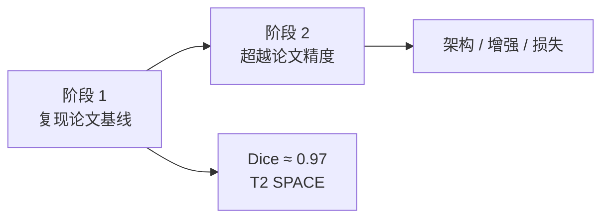

### 分割类别（4 类）

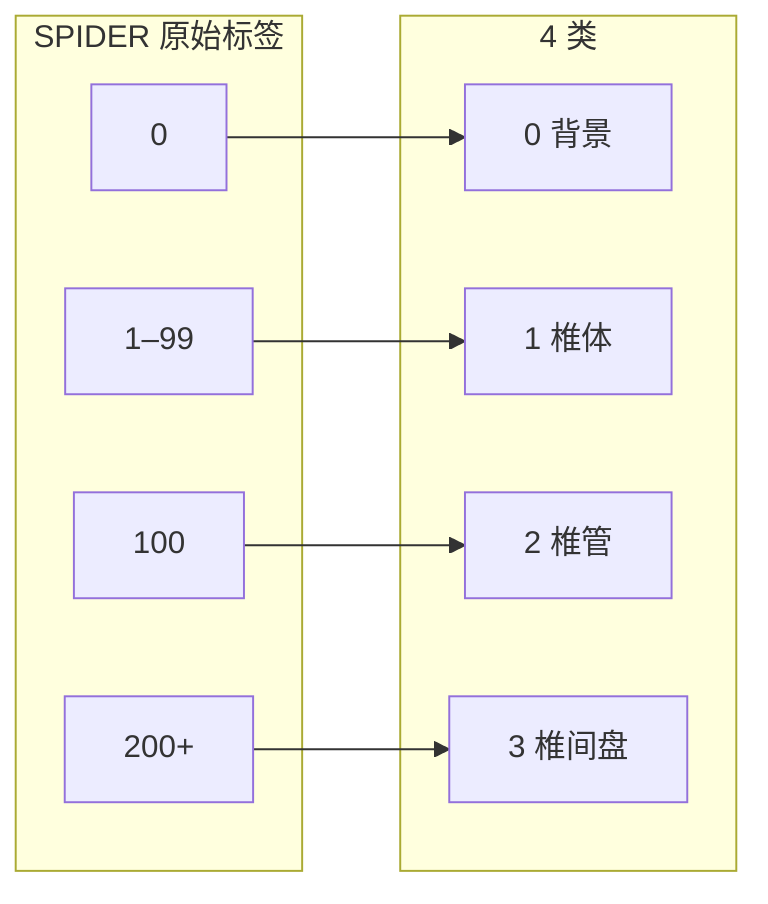

| ID | 结构 | SPIDER 原始标签 |
| ---: | --- | --- |
| 0 | 背景 (Background) | `0` |
| 1 | 椎体 (Vertebrae) | `1–99` |
| 2 | 椎管 (Spinal Canal) | `100` |
| 3 | 椎间盘 (IVDs) | `200+` |

### 论文目标指标（T2 SPACE，参考）

| 结构 | Dice | IoU |
| --- | ---: | ---: |
| IVDs | 0.9688 | 0.9476 |
| Vertebrae | 0.9712 | 0.9461 |
| Spinal Canal | 0.9671 | 0.9501 |

---

## 整体流程（研究流水线）

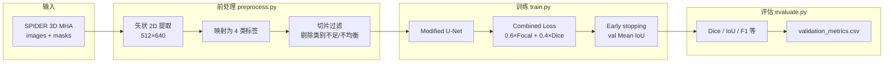

---

## 数据流（详细）

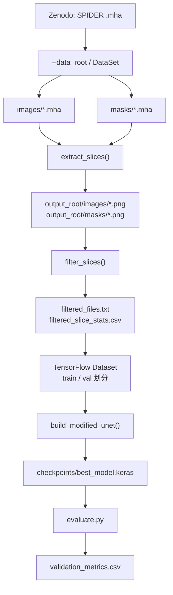

### 过滤条件（与论文一致）

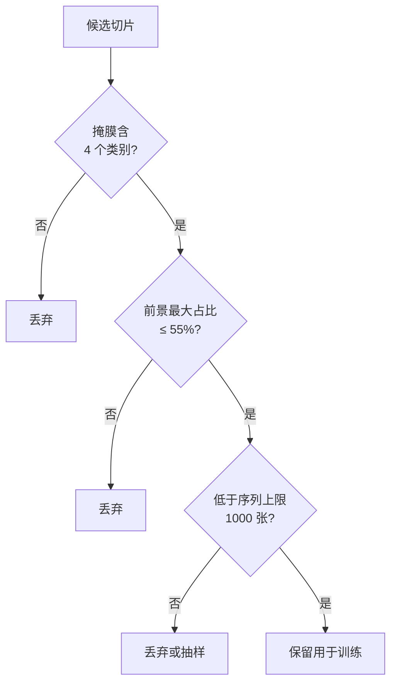

---

## 模型与损失

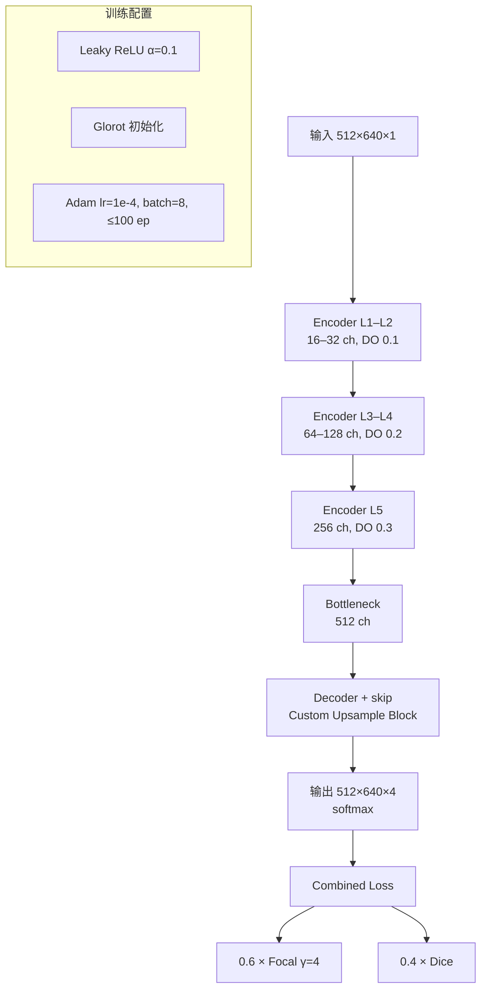

---

## 仓库结构

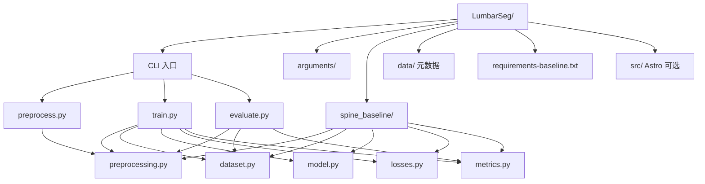

---

## 快速开始

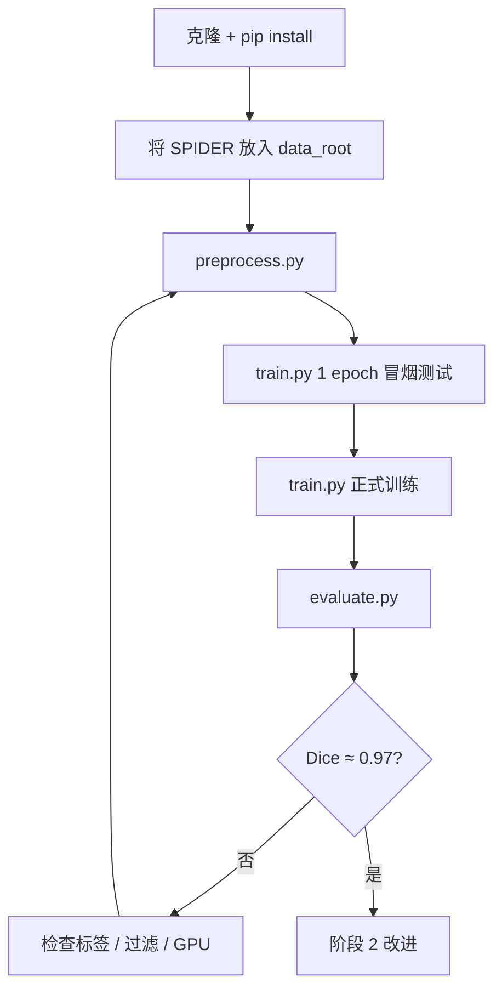

### 1. 克隆与安装

```bash
git clone https://github.com/Sol-momma/LumbarSeg.git
cd LumbarSeg
python -m venv .venv
source .venv/bin/activate   # Windows: .venv\Scripts\activate
pip install -r requirements-baseline.txt
```

使用 Nix：先执行 `nix develop`，再按上式创建 `.venv`。

### 2. 数据目录

从 [Zenodo](https://doi.org/10.5281/zenodo.10159290) 获取 SPIDER，并按如下组织（详见 [data/README.md](data/README.md)）：

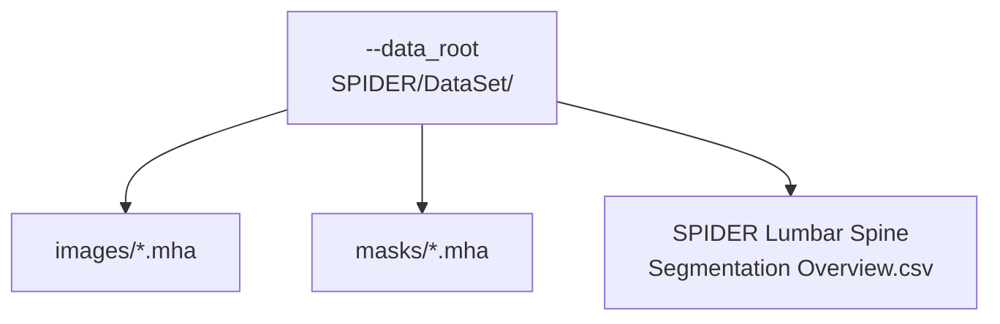

### 3. 前处理

```bash
python preprocess.py \
  --data_root /path/to/SPIDER/DataSet \
  --output_root outputs/t2_space_baseline \
  --sequences T2_SPACE
```

### 4. 冒烟测试（必做）

正式训练前用 **1 个 epoch** 确认流水线正常：

```bash
python train.py \
  --data_root /path/to/SPIDER/DataSet \
  --output_root outputs/t2_space_baseline \
  --sequences T2_SPACE \
  --epochs 1 \
  --batch_size 2
```

### 5. 正式训练

```bash
python train.py \
  --data_root /path/to/SPIDER/DataSet \
  --output_root outputs/t2_space_baseline \
  --sequences T2_SPACE \
  --batch_size 8 \
  --epochs 100
```

输出示例：

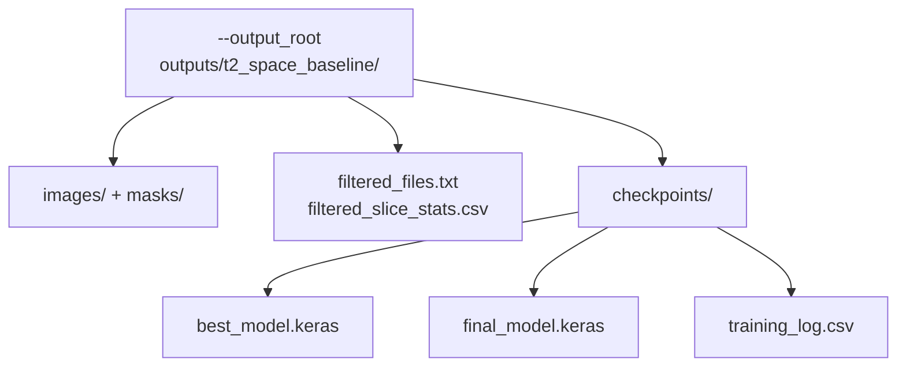

### 6. 评估

```bash
python evaluate.py \
  --data_root /path/to/SPIDER/DataSet \
  --output_root outputs/t2_space_baseline \
  --model_path outputs/t2_space_baseline/checkpoints/best_model.keras
```

---

## Google Colab（建议使用 GPU）

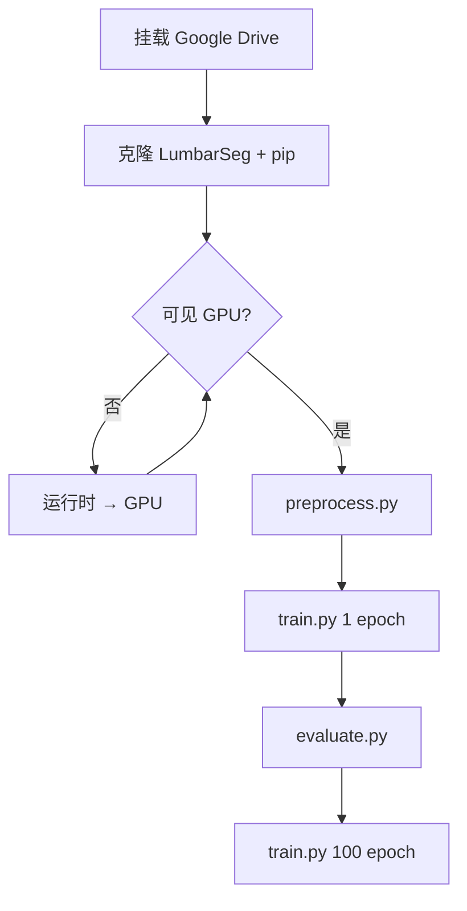

```python
from google.colab import drive
drive.mount("/content/drive")
```

```bash
%cd /content
!test -d LumbarSeg && (cd LumbarSeg && git pull) || git clone https://github.com/Sol-momma/LumbarSeg.git
%cd /content/LumbarSeg
!pip install -q -r requirements-baseline.txt
```

```python
import tensorflow as tf
print(tf.__version__)
print(tf.config.list_physical_devices("GPU"))  # 若为 []，请将运行时切换为 GPU
```

```bash
!python preprocess.py \
  --data_root /content/drive/MyDrive/SPIDER/DataSet \
  --output_root /content/drive/MyDrive/SPIDER/outputs/t2_space_baseline \
  --sequences T2_SPACE

!python train.py \
  --data_root /content/drive/MyDrive/SPIDER/DataSet \
  --output_root /content/drive/MyDrive/SPIDER/outputs/t2_space_baseline \
  --sequences T2_SPACE \
  --epochs 1 --batch_size 2

!python evaluate.py \
  --data_root /content/drive/MyDrive/SPIDER/DataSet \
  --output_root /content/drive/MyDrive/SPIDER/outputs/t2_space_baseline \
  --model_path /content/drive/MyDrive/SPIDER/outputs/t2_space_baseline/checkpoints/best_model.keras
```

> **注意：** 若运行时仍为 CPU，训练会非常慢。请在 Colab 中选择 **运行时 → 更改运行时类型 → GPU** 后再执行。

---

## 进度（截至 2026 年 6 月）


---

## 主要 CLI 参数

| 参数 | 默认值 | 说明 |
| --- | ---: | --- |
| `--target_height` / `--target_width` | 512 / 640 | 输入切片尺寸 |
| `--sequences` | 全部序列 | `T1`、`T2`、`T2_SPACE`（逗号分隔） |
| `--imbalance_threshold` | 0.55 | 前景最大类占比上限 |
| `--max_slices_per_sequence` | 1000 | 每序列保留上限（`0` 为不限制） |
| `--batch_size` | 8 | 批大小 |
| `--epochs` | 100 | 最大 epoch 数 |
| `--focal_weight` / `--focal_gamma` | 0.6 / 4.0 | Combined Loss |
| `--patience` | 15 | Early stopping 耐心值 |

---

## 参考文献

1. Ahmed, I. et al. *Pioneering Precision in Lumbar Spine MRI Segmentation with Advanced Deep Learning and Data Enhancement.* Machine Learning with Applications, Vol. 20, 2025.  
2. van der Graaf, J.W. et al. *Lumbar spine segmentation in MR images: a dataset and a public benchmark.* Scientific Data, 11:264, 2024.
