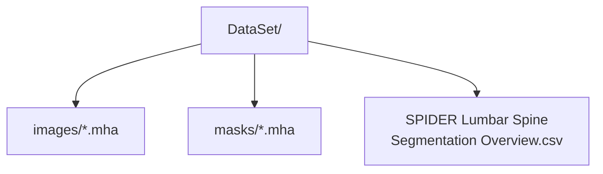

# SPIDER データセット参照ファイル

**Languages / 语言 / 言語:** [English](README.md) · [简体](README.zh-CN.md) · [繁體](README.zh-TW.md) · **日本語**

このディレクトリには **MRI 画像本体は含まれません**。SPIDER 公式配布物から取得したメタデータのみを置いています。

| ファイル | 内容 |
| --- | --- |
| `SPIDER Lumbar Spine Segmentation Overview.csv` | 447 シリーズの DICOM メタデータ（シーケンス種別・スライス厚など） |
| `SPIDER Lumbar Spine Segmentation Dataset.json` | Zenodo 配布パッケージの説明（JSON） |

## 学習用データの配置（Google Drive / ローカル）

実際の `.mha` は別途 Zenodo から取得し、次の構成で `--data_root` に指定します。

- データセット: [SPIDER on Zenodo](https://doi.org/10.5281/zenodo.10159290)  
- 論文: van der Graaf et al., Scientific Data, 2024
