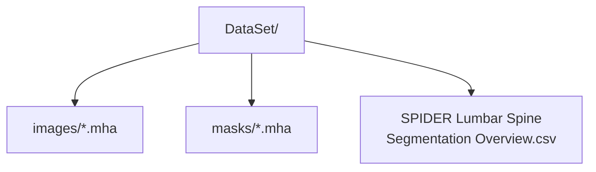

# SPIDER Dataset Reference Files

**Languages / 语言 / 言語:** **English** · [中文](README.zh-CN.md) · [日本語](README.ja.md)

This directory contains **metadata only** — no MRI volumes are stored in the repository.

| File | Description |
| --- | --- |
| `SPIDER Lumbar Spine Segmentation Overview.csv` | DICOM metadata for 447 series (sequence type, slice thickness, etc.) |
| `SPIDER Lumbar Spine Segmentation Dataset.json` | Zenodo package description (JSON) |

## Training Data Layout (local / Google Drive)

Download `.mha` files from Zenodo and point `--data_root` to:

- Dataset: [SPIDER on Zenodo](https://doi.org/10.5281/zenodo.10159290)  
- Paper: van der Graaf et al., Scientific Data, 2024
