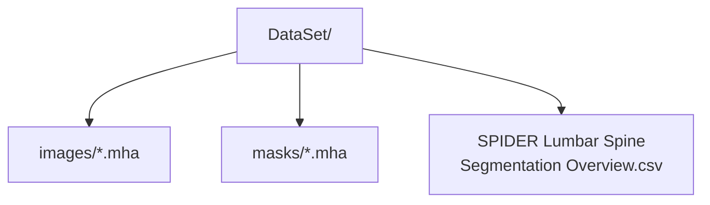

# SPIDER 数据集参考文件

**Languages / 语言 / 言語:** [English](README.md) · **中文** · [日本語](README.ja.md)

本目录**不包含 MRI 体数据**，仅存放从 SPIDER 官方包获取的元数据。

| 文件 | 说明 |
| --- | --- |
| `SPIDER Lumbar Spine Segmentation Overview.csv` | 447 个序列的 DICOM 元数据（序列类型、层厚等） |
| `SPIDER Lumbar Spine Segmentation Dataset.json` | Zenodo 发布包说明（JSON） |

## 训练数据目录（本地 / Google Drive）

需从 Zenodo 单独下载 `.mha`，并将 `--data_root` 指向：

- 数据集: [SPIDER on Zenodo](https://doi.org/10.5281/zenodo.10159290)  
- 论文: van der Graaf et al., Scientific Data, 2024
