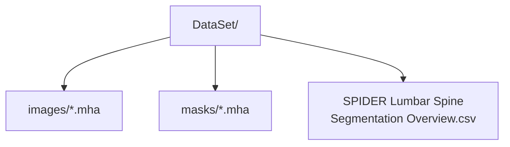

# SPIDER 資料集參考檔案

**Languages / 语言 / 言語:** [English](README.md) · [简体](README.zh-CN.md) · **繁體** · [日本語](README.ja.md)

本目錄**不包含 MRI 體資料**，僅存放從 SPIDER 官方套件取得的元資料。

| 檔案 | 說明 |
| --- | --- |
| `SPIDER Lumbar Spine Segmentation Overview.csv` | 447 個序列的 DICOM 元資料（序列類型、層厚等） |
| `SPIDER Lumbar Spine Segmentation Dataset.json` | Zenodo 發佈套件說明（JSON） |

## 訓練資料目錄（本機 / Google Drive）

需從 Zenodo 單獨下載 `.mha`，並將 `--data_root` 指向：

- 資料集: [SPIDER on Zenodo](https://doi.org/10.5281/zenodo.10159290)  
- 論文: van der Graaf et al., Scientific Data, 2024
