# LumbarSeg

**Languages / 语言 / 言語:** [English](README.md) · [简体](README.zh-CN.md) · [繁體](README.zh-TW.md) · **日本語**

腰椎 MRI の **4クラスセグメンテーション** を、Ahmed et al. (2025) のベースライン（Modified U-Net + Combined Loss）で再現する卒業研究用リポジトリです。

| リンク | |
| --- | --- |
| 論文（再現対象） | [Ahmed et al., 2025](https://www.sciencedirect.com/science/article/pii/S2666827025000180) |
| データセット | [SPIDER (Zenodo)](https://doi.org/10.5281/zenodo.10159290) |
| プロジェクトサイト | [lumbarseg.github.io](https://lumbarseg.github.io/) |

---

## リポジトリ分離

このリポジトリは、再現実験用のコードと実験ドキュメントに集中させます。Astro の Web サイトソースは、FastGS と同じようにコード本体とプロジェクトページを分けるため、別のローカルリポジトリ `../lumbarseg.github.io` に移動しました。

各リポジトリに置く内容は [REPOSITORY_SPLIT.md](REPOSITORY_SPLIT.md) を参照してください。

---

## 研究の目的

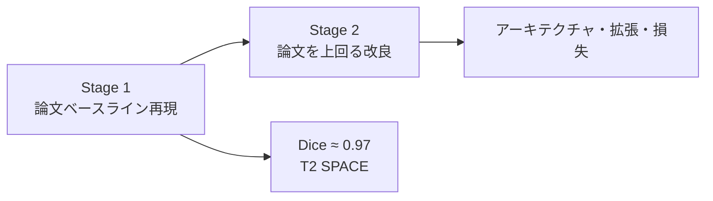

### セグメンテーションクラス（4クラス）

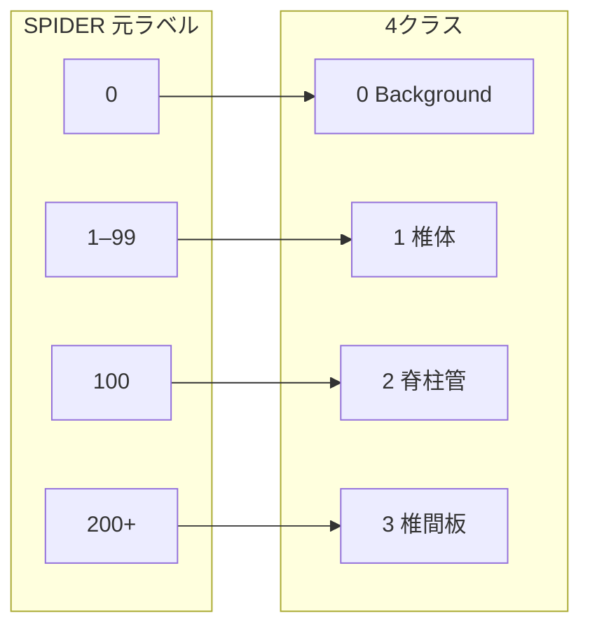

| ID | 構造 | SPIDER 元ラベル |
| ---: | --- | --- |
| 0 | Background | `0` |
| 1 | Vertebrae（椎体） | `1–99` |
| 2 | Spinal Canal（脊柱管） | `100` |
| 3 | IVDs（椎間板） | `200+` |

### 論文の目標指標（T2 SPACE・参考）

| 構造 | Dice | IoU |
| --- | ---: | ---: |
| IVDs | 0.9688 | 0.9476 |
| Vertebrae | 0.9712 | 0.9461 |
| Spinal Canal | 0.9671 | 0.9501 |

---

## 全体の流れ（研究パイプライン）

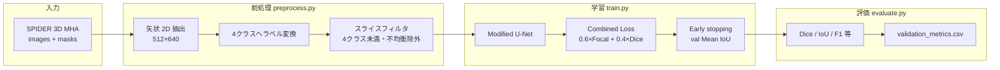

---

## データの流れ（詳細）

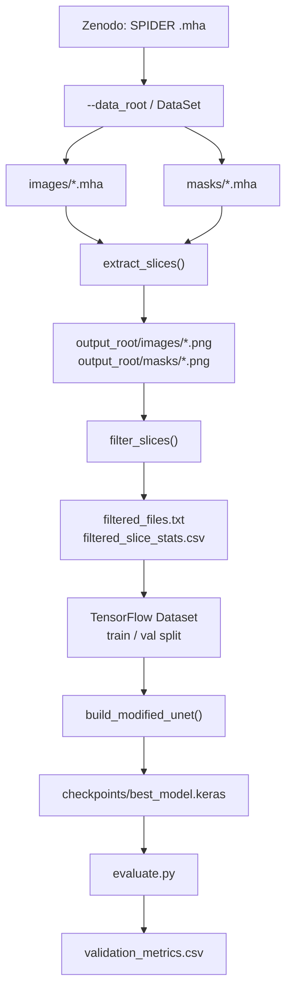

### フィルタ条件（論文準拠）

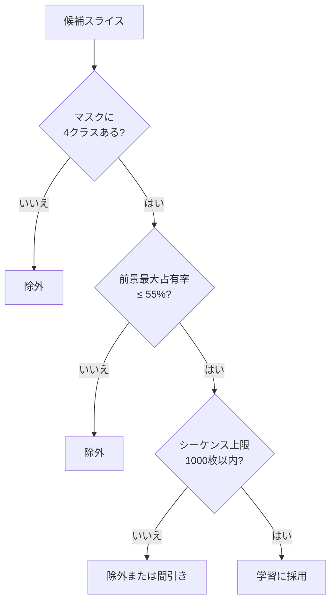

---

## モデルと損失

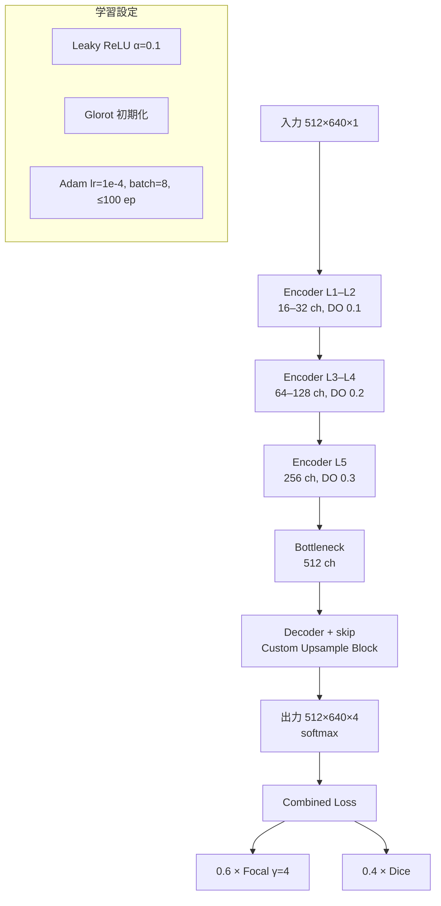

---

## リポジトリ構成

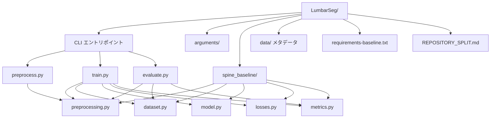

---

## クイックスタート

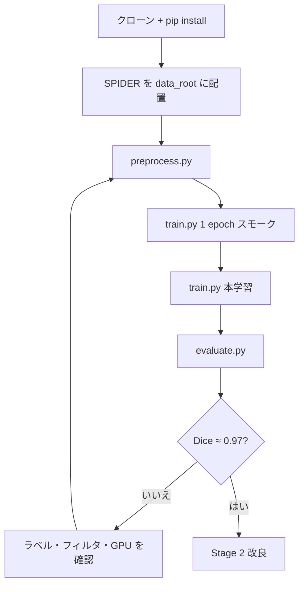

### 1. クローンと依存関係

```bash
git clone https://github.com/Sol-momma/LumbarSeg.git
cd LumbarSeg
python -m venv .venv
source .venv/bin/activate   # Windows: .venv\Scripts\activate
pip install -r requirements-baseline.txt
```

Nix を使う場合: `nix develop` のあと、上と同様に `.venv` を作成してください。

### 2. データ配置

[Zenodo](https://doi.org/10.5281/zenodo.10159290) から SPIDER を取得し、次の形にします（詳細は [data/README.md](data/README.md)）。

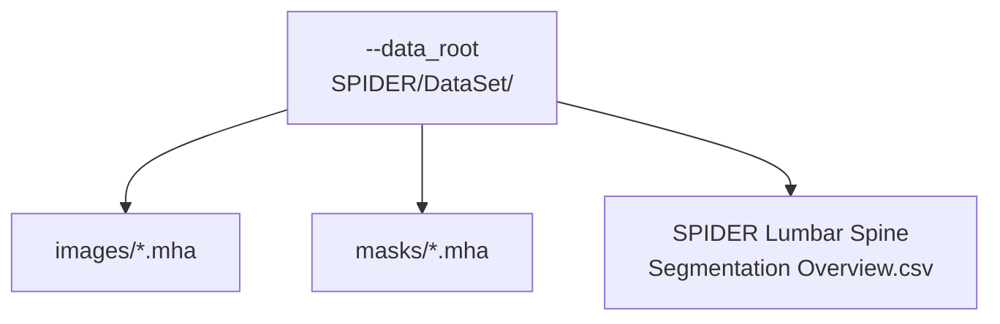

### 3. 前処理

```bash
python preprocess.py \
  --data_root /path/to/SPIDER/DataSet \
  --output_root outputs/t2_space_baseline \
  --sequences T2_SPACE
```

### 4. スモークテスト（必須）

本学習の前に **1 epoch** でパイプラインを確認します。

```bash
python train.py \
  --data_root /path/to/SPIDER/DataSet \
  --output_root outputs/t2_space_baseline \
  --sequences T2_SPACE \
  --epochs 1 \
  --batch_size 2
```

### 5. 本学習

```bash
python train.py \
  --data_root /path/to/SPIDER/DataSet \
  --output_root outputs/t2_space_baseline \
  --sequences T2_SPACE \
  --batch_size 8 \
  --epochs 100
```

出力例:

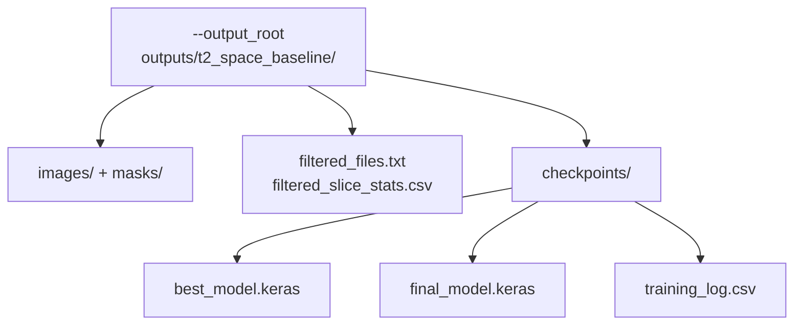

### 6. 評価

```bash
python evaluate.py \
  --data_root /path/to/SPIDER/DataSet \
  --output_root outputs/t2_space_baseline \
  --model_path outputs/t2_space_baseline/checkpoints/best_model.keras
```

---

## Google Colab（GPU 推奨）

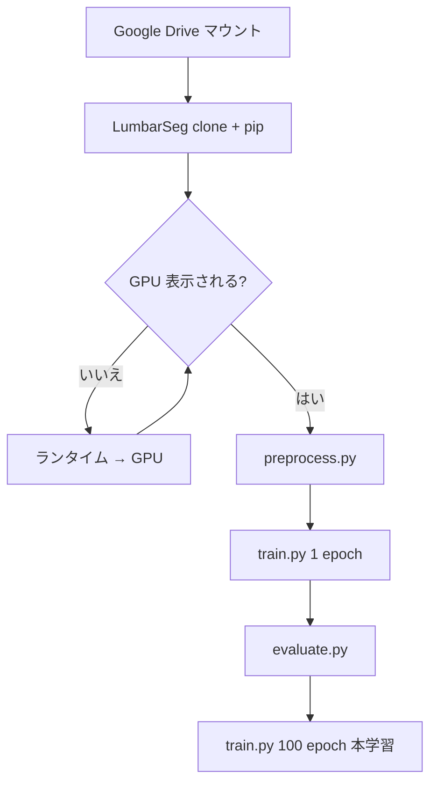

```python
from google.colab import drive
drive.mount("/content/drive")
```

```bash
%cd /content
!test -d LumbarSeg && (cd LumbarSeg && git pull) || git clone https://github.com/Sol-momma/LumbarSeg.git
%cd /content/LumbarSeg
!pip install -q -r requirements-baseline.txt
```

```python
import tensorflow as tf
print(tf.__version__)
print(tf.config.list_physical_devices("GPU"))  # GPU が [] のときはランタイムを GPU に変更
```

```bash
!python preprocess.py \
  --data_root /content/drive/MyDrive/SPIDER/DataSet \
  --output_root /content/drive/MyDrive/SPIDER/outputs/t2_space_baseline \
  --sequences T2_SPACE

!python train.py \
  --data_root /content/drive/MyDrive/SPIDER/DataSet \
  --output_root /content/drive/MyDrive/SPIDER/outputs/t2_space_baseline \
  --sequences T2_SPACE \
  --epochs 1 --batch_size 2

!python evaluate.py \
  --data_root /content/drive/MyDrive/SPIDER/DataSet \
  --output_root /content/drive/MyDrive/SPIDER/outputs/t2_space_baseline \
  --model_path /content/drive/MyDrive/SPIDER/outputs/t2_space_baseline/checkpoints/best_model.keras
```

> **注意**: ランタイムが CPU のままだと学習が極端に遅くなります。Colab メニュー「ランタイムのタイプを変更」→ **GPU** を選んでから実行してください。

---

## 進捗（2026年6月時点）


---

## 主要 CLI 引数

| 引数 | 既定値 | 説明 |
| --- | ---: | --- |
| `--target_height` / `--target_width` | 512 / 640 | 入力スライスサイズ |
| `--sequences` | なし（全シーケンス） | `T1`, `T2`, `T2_SPACE`（カンマ区切り可） |
| `--imbalance_threshold` | 0.55 | 前景クラス最大比率の上限 |
| `--max_slices_per_sequence` | 1000 | シーケンスごとの保持上限（0 で無制限） |
| `--batch_size` | 8 | バッチサイズ |
| `--epochs` | 100 | 最大エポック数 |
| `--focal_weight` / `--focal_gamma` | 0.6 / 4.0 | Combined Loss |
| `--patience` | 15 | Early stopping |

---

## 参考文献

1. Ahmed, I. et al. *Pioneering Precision in Lumbar Spine MRI Segmentation with Advanced Deep Learning and Data Enhancement.* Machine Learning with Applications, Vol. 20, 2025.  
2. van der Graaf, J.W. et al. *Lumbar spine segmentation in MR images: a dataset and a public benchmark.* Scientific Data, 11:264, 2024.
